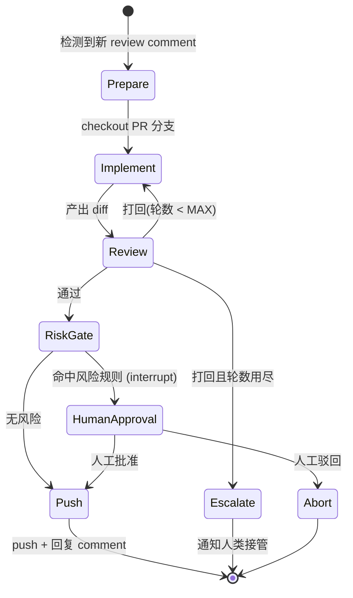

# reviewloop 设计文档

## 1. 想要解决的问题

在 AI 辅助开发已经普及的团队里,一个越来越典型的工作形态是:开发者把任务交给 AI 完成,自己负责审阅 AI 的产出,提交给 reviewer(mentor/同事)评审,再把评审意见转交给 AI 修改,如此循环直到 approve。

这个流程里,人实际承担的是**转发和确认**:把 review comment 复制给 AI、看一眼 AI 的修改、push、等下一轮。这些动作机械、打断感强,但又不能完全放手——因为 AI 的修改可能引入风险(误删数据、改动认证逻辑、破坏性迁移),需要人守住最后一道闸门。

reviewloop 要做的事:**把「comment → 修改 → 自查 → push」这条循环交给一组分工明确的 agent,人只在两个位置介入——风险操作的审批,和最终对产出负责的抽查。**

## 2. 为什么是 multi-agent(而不是单 agent 或流水线)

单个 agent 也能"收到 comment 就改代码",但有一个结构性缺陷:**让写代码的 agent 自查自己的代码,结论没有公信力**。同一个上下文里的模型会系统性地偏袒自己刚刚写下的东西(context contamination)。

因此本系统的 multi-agent 不是"多个 agent 聊天协作",而是**利益分离**:

| 角色 | 职责 | 关键设计 |
|---|---|---|
| Implementer | 读 review comment,修改代码,跑测试 | 在 PR 分支的工作副本上操作,**没有 push 权限** |
| Reviewer | 只看 diff + rulebook,给出 通过/打回+理由 | **每轮全新上下文**,只读工具,不知道实现过程 |
| Risk Gate | 对最终 diff 做风险分类 | 规则优先(路径/模式匹配),命中即暂停等人批 |
| Orchestrator | 状态机,控制轮次和路由 | 确定性代码,不是 LLM |

两个容易被问到的设计决定:

- **Reviewer 为什么每轮全新上下文?** 如果它记得"已经打回三次了",第四次会倾向于疲劳性放行。无状态保证严格度恒定;跨轮记忆由 rulebook(显式规则)和 Orchestrator(轮次计数)携带。
- **权限设计代替行为约束。** 不靠提示词叮嘱 agent"别乱来":Implementer 的工具白名单里没有 push,Reviewer 没有写文件的工具。唯一能 push 的是 Orchestrator 的确定性代码,且只在 Reviewer 通过 + Risk Gate 放行之后执行。

## 3. 状态机

工作流显式建模为状态机(LangGraph `StateGraph`),而不是让 agent 自由对话——出错时必须能回答"谁在什么时候基于什么信息做了这个决定"。

要点:

- **Risk Gate 放在 Review 通过之后、Push 之前**——它守的是不可逆动作(push),审的是最终形态的 diff,人只需要批一次。
- **HumanApproval 用 LangGraph 的 `interrupt()` 实现**:图暂停、状态落盘(SQLite checkpointer)、进程可以退出;人批准后用 `Command(resume=...)` 从断点恢复。审批不阻塞其他 PR 的处理。
- **Escalate 是特性不是失败**:Implementer 和 Reviewer 拉锯超过 MAX_ROUNDS(默认 3)说明这个 comment 超出系统能力,正确行为是原样上报,而不是硬着头皮 push 一个双方都不满意的版本。

## 4. rulebook 机制:让 review 意见变成资产

每次人类 reviewer 的 comment 被处理后,可以沉淀为一条显式规则写入 `rulebook/rules.md`(MVP 阶段人工维护,后续可加 curator agent 自动提炼)。Reviewer agent 每轮都会带着 rulebook 审 diff。

效果:**同类意见只会被人类提出一次**,之后由 Reviewer agent 在内部循环中拦截。这是系统能随时间变强的唯一机制,也是静态流水线做不到的。

## 5. 技术选型

| 层 | 选择 | 落选项与理由 |
|---|---|---|
| 编排 | LangGraph | CrewAI:控制流藏在角色扮演抽象里,难调试;AutoGen:以 agent 自由对话为中心,正是要避免的形态。LangGraph 把工作流显式建模为图,`interrupt()` 原生支持 human-in-the-loop |
| 执行 | Claude Agent SDK (Python) | 用 LangChain Tools 自己攒 coding agent = 从零重写一个 agent harness(文件编辑、测试反馈循环、上下文管理),效果差且不是本项目重点 |
| 状态持久化 | SQLite checkpointer | 负载是"一天几个 PR 事件",不是吞吐问题;Celery/Redis 是拿队列解决持久化问题,用错药 |
| 触发 | 轮询 (gh CLI) | webhook 需要公网端点,MVP 不值得;轮询零基建 |
| 可观测 | JSONL 结构化日志 | LangSmith 会把含源码的 trace 传到第三方云端,不默认引入 |

## 6. 范围(考核版刻意不做的)

- Planner 并行拆任务(依赖 Implementer⇄Reviewer 循环先稳定)
- QA agent 浏览器自动化动作确认
- curator agent 自动提炼 rulebook
- Slack 审批通道(MVP 用 CLI 审批,接口留好)

范围控制本身是设计决定:一条完整可演示的闭环 > 四条半成品。
